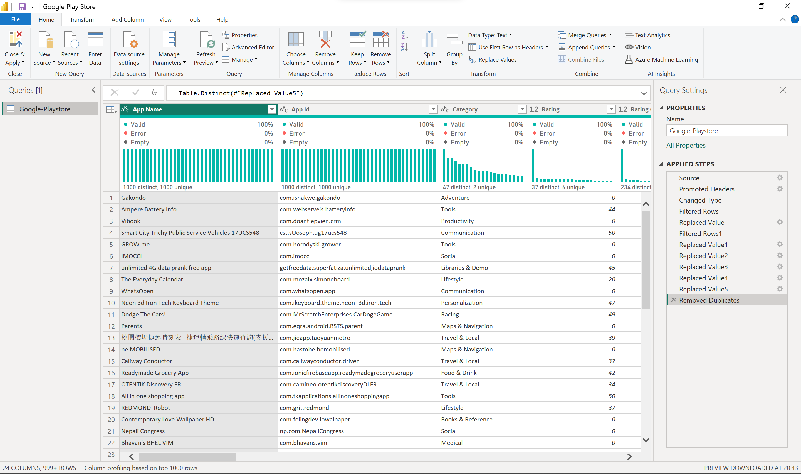
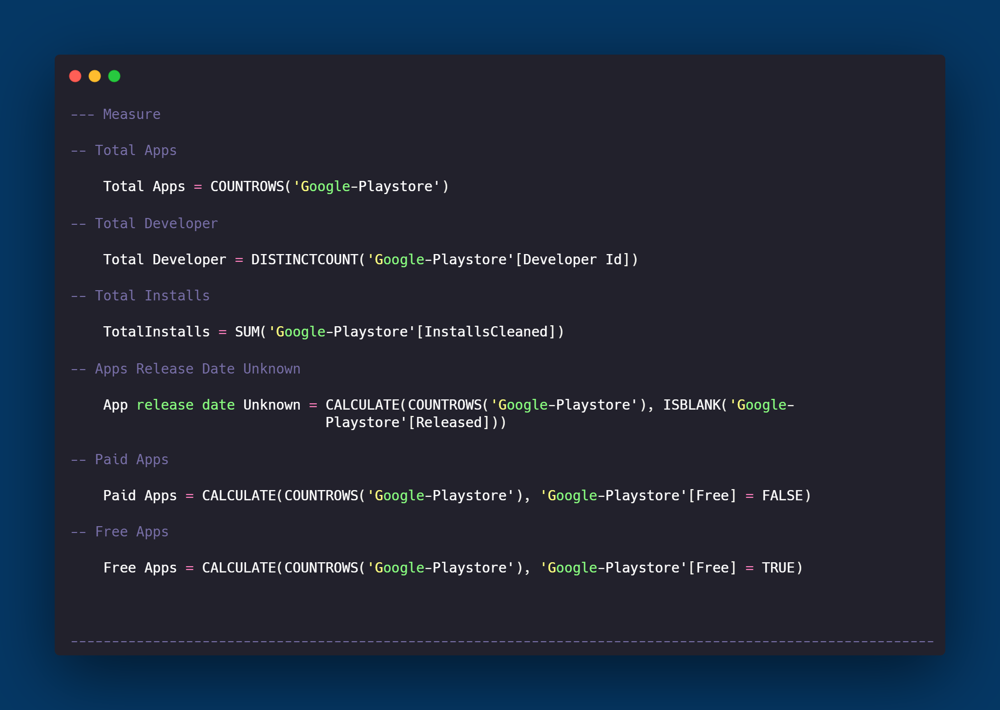
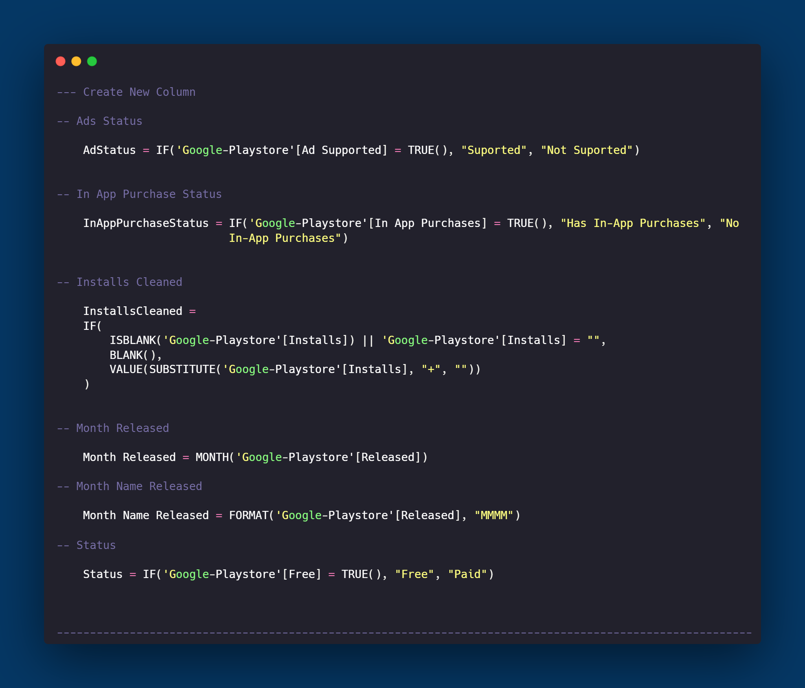
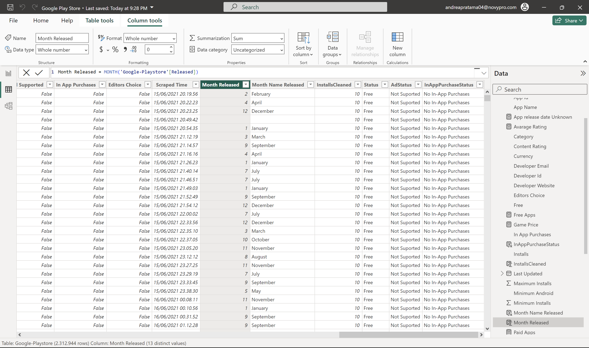
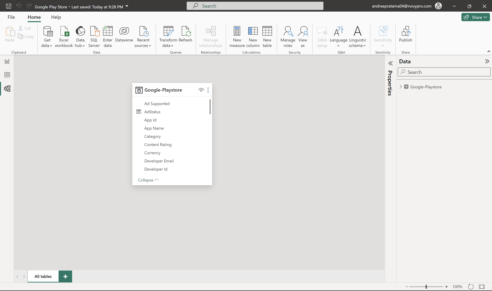

# Google Play Store Apps Analysis

## 1. Introduction
This analysis project aims to understand the trends and characteristics of apps in the Google Play Store. Through the use of Power BI, to summarize important information about the number of apps, developers, app types, and more to provide users with a comprehensive view.

## 2. Problem Statement
There are several key questions that we aim to answer through this project, including:
- How is the distribution of app types on the Google Play Store?
- What are the trends in app installations over time?
- Is there a correlation between ratings, number of installations, and content types?

## 3. Skill Demonstrated

- Exploring and transforming data using Power BI.
- Utilizing DAX (Data Analysis Expressions) to create custom measures and calculate other measurable values.
- Implementing filter functions to present focused information.
- Using bookmarks to provide "Clear All Filters" functionality for users to easily reset the dashboard view.
- Interactive Dashboard.

## 4. Data Sourcing
The dataset used is sourced from [Kaggle](https://www.kaggle.com/) and includes information about more than 2 million apps on the Google Play Store.

## 5. Data Transformation
Data transformation processes involve adjusting data types, handling null values,replace values,create a new column to simplify the data and creating new measures for further analysis.

### DAX used in this project

### Create New Column

## 6. Modeling
Since project primarily involves a single dataset, extensive data modeling processes were not required. The focus was on exploring and transforming the dataset to extract valuable insights directly.

## 7. Analyze & Visualization
At this stage, analyze data to identify trends and build visualizations that explain key characteristics of apps on the Google Play Store. Some visualizations include:
- Highest installations analysis by category.
- Percentage of apps supporting ads and in-app purchases.
- Relationship between rating, number of installations, and app content.

And many more.

In this project there are 2 pages :
- Overview
- Apps

You can interact with report here [Novypro](https://www.novypro.com/project/google-play-store-2)

## 8. Conclusion & Recommendation
Based on the analysis of the Google Play Store Apps dataset, there are the following key takeaways:

### 1. Game Release Trend:
   - There is a notable increase in game releases, starting in 2015 and reaching its peak in 2020. This suggests a growing interest and development focus on gaming applications over the years.

### 2. Most Installed Categories:
   - The highest number of installations is observed in categories that impact daily life, such as Tools, Communication, and Productivity. This indicates a user preference for applications that enhance day-to-day activities.

### 3. Content Rating Influence:
   - Games with a content rating of "Everyone" dominate both in development and installations. This suggests a wide appeal and popularity of family-friendly games among users.

### 4. Ads Support Balance:
   - The distribution between applications supporting ads and those that do not is nearly balanced. This implies that developers are adopting diverse monetization strategies, including both ad-supported and non-ad-supported models.

### 5. Limited In-App Purchases:
   - A significant observation is that 91% of apps on the Google Play Store do not feature in-app purchases. This indicates that a large portion of applications follows a free-to-use model without relying on in-app transactions for revenue.

### 6. Varied Minimum Android Versions:
   - The category with the highest installations has applications with a "Varies with device" minimum Android version requirement. This flexibility in minimum Android versions suggests a diverse user base with different device specifications.

In conclusion, the Google Play Store ecosystem displays dynamic trends in app development and user preferences. The increasing focus on gaming, popularity of everyday utility apps, and diverse monetization strategies contribute to a vibrant and evolving landscape on the platform.

---

